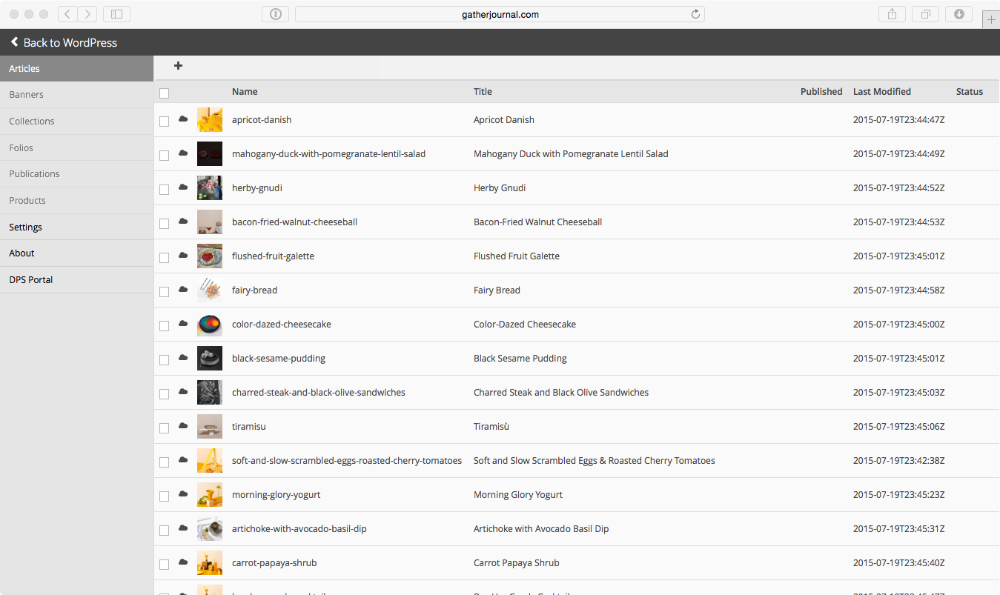
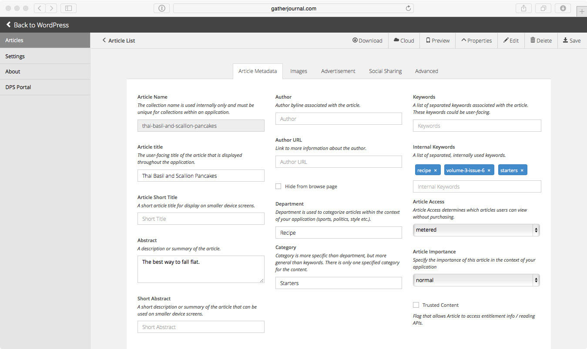
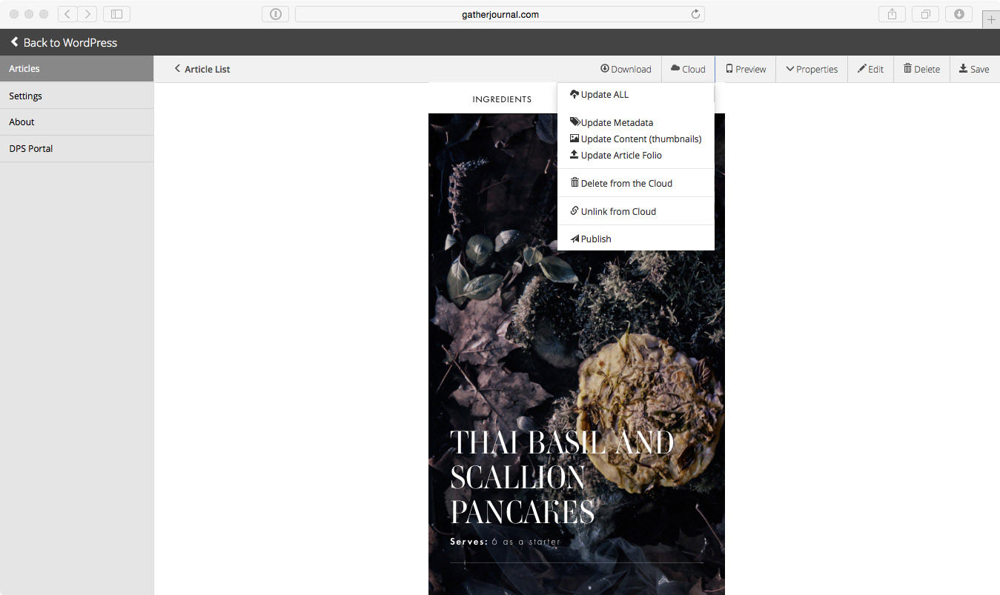
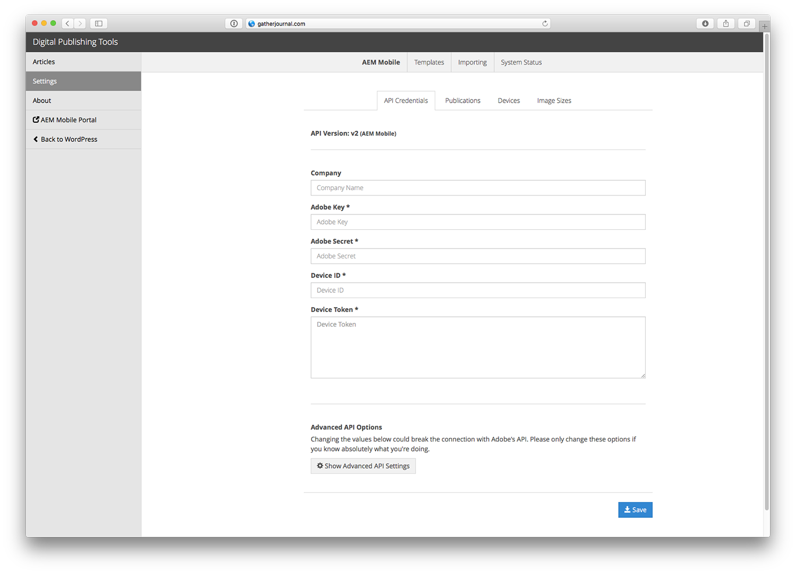

# Digital Publishing Tools for WordPress
### Digital Publishing Tools for WordPress is a plugin that allows anyone to create HTML articles for Digital Publishing Solution directly from WordPress.

**Contributors**: StudioMercury   
**Website**: http://studiomercury.github.io/digital-publishing-tools-for-wordpress/   
**Tags**: digital publishing, publishing, Adobe, DPS, Digital Publishing Solution   
**Requires at least**: Wordpress 3.5   
**Tested up to**: Wordpress 4.3   
**Stable tag**: Wordpress 4.3   
**License**: GPLv2 or later  
**License URI**: http://www.gnu.org/licenses/gpl-2.0.html   

**PREREQUISITE KNOWLEDGE**
* Experience with WordPress (Content Management System) and knowledge of the Adobe Digital Publishing Solution is required. 
* This plugin also assumes you have access to a web server and have basic HTML/CSS knowledge.

**REQUIREMENTS**
* WordPress 3.5 +
* PHP 5.4 or higher
* MySQL 5.0 or higher
* Apache or nginx recommended
* FTP access to the server to install the plugin

**OPTIONAL BUT RECOMMENDED**
* Adobe Digital Publishing Solution API access

## Installation

This section describes how to install the plugin and get it working.

1. Upload the folder `digital-publishing-tools-for-wordpress` to the `/wp-content/plugins/` directory
2. Activate the plugin through the 'Plugins' menu in WordPress
3. Click on the `Digital Publishing` icon on the left navigation menu to get started

## Frequently Asked Questions

**Does the plugin support multiple projects?**  
At this time the plugin only supports one project. Multi-project support is on our roadmap.

**Does this plugin work with Wordpress MU (multi-user)?**  
We haven't tested or explicitly built the plugin to work with Wordpress MU. That's not to say it won't work, only that our initial release didn't target a multi-user enviroment. 

## Screenshots
  
1. Keep track of all of your articles. You can easily create new or import existing articles directly from WordPress.

  
2. Easily edit Article metadata.

  
3. Preview articles before you export them or upload them into the Adobe Digital Publishing Solution platform.

4. The plugin works with Adobe's Digital Publishing Solution. Entering API credentials for DPS will allow you to upload and manipulate articles in Adobe's platform.

## Changelog

### 2.0.10
**TEMPLATE CHANGES**

* If you are using the default template and you haven't moved the `publish-templates` folder into the theme folder, you don't have to do anything.
* If you're using the default template and have moved the `publish-templates` folder into the theme folder, you need to copy the new `publish-templates` folder into your current theme.
* If you've created your own, please review the information below:

   **All relative links will be turned into full URLs:** for example: if you create a link `/image/1.jpg` the packager will turn this into: `http://yourdomain.com/image/1.jpg`. Relative links are no longer relative to the .article file. This is part of a bigger move to allow any theme / template to be packaged. That will come in a release soon.

   **There's a new way to add files to the .article using the** `dpsfa_bundle_article` **filter:**
   
   **Automatic:** Specify full url to file (array of images)
Specifying the full url will create the necessary folder scructure in the article and download the external file
Folder structure for external resources: ARTICLE > sanitized hostname > path > file
Example: array('http://www.domain.com/wp-content/themes/theme/file.jpg') will put that file in the article as: domaincom/wp-content/themes/theme/file.jpg
    
   **Manual:** Specify the full paths array( "file path relative in article" => "filepath relative to server (or url)" )
You can have control over where the file is placed in the article and where to pull it from the server
Example: array( array('slideshow/image/file.jpg' => 'www/wp-content/themes/theme/file.jpg') ) will put that file in the article as: domaincom/wp-content/themes/theme/file.jpg

### 2.0.6
* Resolved article folio uploads with 0bytes (missing files).
* Resolved an issue if template files went missing or were changed
* publish-templates/article.php - now has a file path for files relative to the plugin folder and the theme folder. If you're upgrading to 2.0.6 please make sure to re-copy the publish-templates folder from the plugin folder to the active theme folder you are working in.

### 2.0.5
* Resolved error in checking for serialized meta values
* Resolved error in the article thumbnail when importing them from
existing posts
* Internal keywords now sync

### 2.0.4
* Fixed error in getting settings / refreshing settings
* Added error logging for php errors that show up
* Resolved error in returning and saving settings using AJAX

### 2.0.3
* Fixed a bug where a "/" was being prepended to assets during article bundle. 

### 2.0.2
* Fixed an error when saving in settings
* Updated the example article.php to expose a function to bundle additional files for an article. 

### 2.0.1
* Cleaned up sample templates

### 2.0.0
* NEW Access to the new DPS 2015 API's and services
* Article Creation

### 1.0.0
* Old Release with access to the original version of DPS, this is currently deprecated.

## Upgrade Notice
* nothing to see here